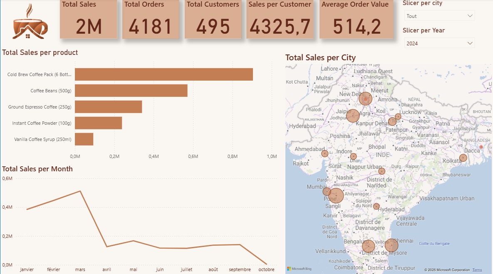

# Monday Coffee Expansion SQL Project


## Objective
The goal of this project is to analyze the sales data of Monday Coffee, a company that has been selling its products online since January 2023, and to recommend the top three major cities in India for opening new coffee shop locations based on consumer demand and sales performance.

## Key Questions
1. **Coffee Consumers Count**  
   How many people in each city are estimated to consume coffee, given that 25% of the population does?
```sql
SELECT 
	city_id,
	city_name,
	ROUND((population * 0.25)/1000000, 2) AS Estimated_consumers_millions,
	city_rank
FROM city
ORDER BY Estimated_consumers_millions DESC;
```

2. **Total Revenue from Coffee Sales**  
   What is the total revenue generated from coffee sales across all cities in the last quarter of 2023?
```sql
SELECT
	ct.city_id,
	ct.city_name,
	SUM(s.total) AS Total_revenue
FROM sales AS s
LEFT JOIN customers AS c
ON s.customer_id = c.customer_id
LEFT JOIN city as ct
ON c.city_id = ct.city_id
WHERE sale_date >= '01-10-2023'
	AND sale_date < '01-01-2024'
GROUP BY ct.city_id, ct.city_name
ORDER BY total_revenue DESC;
```

3. **Sales Count for Each Product**  
   How many units of each coffee product have been sold?
```sql
SELECT 
	p.product_id,
	p.product_name,
	COUNT(s.sale_id) AS Total_units_sold
FROM products AS p
LEFT JOIN sales AS s
ON p.product_id = s.product_id
GROUP BY p.product_id, p.product_name
ORDER BY Total_units_sold DESC;
```

4. **Average Sales Amount per City**  
   What is the average sales amount per customer in each city?
```sql
SELECT 
	ct.city_name,
	SUM(s.total) AS Total_revenue,
	COUNT(DISTINCT s.customer_id) AS Total_customers,
	ROUND(
			(SUM(s.total)/
				COUNT(DISTINCT s.customer_id))::numeric
			,2) AS AVG_sales_per_customer
FROM sales AS s
LEFT JOIN customers AS c
ON s.customer_id = c.customer_id
LEFT JOIN city AS ct
ON c.city_id = ct.city_id
GROUP BY ct.city_name
ORDER BY avg_sales_per_customer DESC;
```

5. **City Population and Coffee Consumers**  
   Provide a list of cities along with their populations and estimated coffee consumers.
```sql
SELECT 
	ct.city_id,
	ct.city_name,
	ct.population,
	ROUND(ct.population * 0.25 / 1000000, 2) AS Potential_consumers_millions,
	COUNT(c.customer_id) AS estimated_consumers
FROM city AS ct
INNER JOIN customers AS c
ON c.city_id = ct.city_id
GROUP BY ct.city_id, ct.city_name, ct.population
ORDER BY estimated_consumers DESC;
```

6. **Top Selling Products by City**  
   What are the top 3 selling products in each city based on sales volume?
```sql
WITH prod_city AS (
  SELECT
    ct.city_id,
    ct.city_name,
    p.product_id,
    p.product_name,
    COUNT(s.sale_id) AS Total_sales              
  FROM sales s
  JOIN customers c ON s.customer_id = c.customer_id
  JOIN city ct      ON c.city_id = ct.city_id
  JOIN products p   ON s.product_id = p.product_id
  GROUP BY ct.city_id, ct.city_name, p.product_id, p.product_name
),
ranked AS (
  SELECT *,
         DENSE_RANK() OVER (PARTITION BY city_id ORDER BY Total_sales DESC) AS rnk
  FROM prod_city
)
SELECT city_name, product_name, Total_sales
FROM ranked
WHERE rnk <= 3
ORDER BY city_name, rnk, product_name;
```

7. **Customer Segmentation by City**  
   How many unique customers are there in each city who have purchased coffee products?
```sql
WITH t1 AS ( 
	SELECT
		ct.city_id,
		ct.city_name,
		p.product_id,
		p.product_name,
		COUNT(DISTINCT c.customer_id) AS Total_customers
	FROM customers AS c
	INNER JOIN sales AS s ON c.customer_id = s.customer_id
	INNER JOIN city AS ct ON c.city_id = ct.city_id
	INNER JOIN products p  ON s.product_id = p.product_id 
	GROUP BY ct.city_id, ct.city_name, p.product_id, p.product_name
)
SELECT * FROM t1
WHERE product_id <= 14;
```

8. **Average Sale vs Rent**  
   Find each city and their average sale per customer and avg rent per customer
```sql
WITH city_table AS (
  SELECT 
    ci.city_id,
    ci.city_name,
    SUM(s.total)::numeric AS total_revenue,
    COUNT(DISTINCT s.customer_id) AS total_cx,
    ROUND(
      SUM(s.total)::numeric / NULLIF(COUNT(DISTINCT s.customer_id), 0), 2
    ) AS avg_sale_pr_cx
  FROM sales s
  JOIN customers c ON s.customer_id = c.customer_id
  JOIN city ci      ON ci.city_id = c.city_id
  GROUP BY ci.city_id, ci.city_name
),
city_rent AS (
  SELECT city_id, city_name, estimated_rent
  FROM city
)
SELECT 
  cr.city_id,
  cr.city_name,
  cr.estimated_rent,
  ct.total_cx,
  ct.avg_sale_pr_cx,
  -- If estimated_rent is a TOTAL city rent, keep the division:
  ROUND(cr.estimated_rent::numeric / NULLIF(ct.total_cx, 0), 2) AS avg_rent_per_cx
  -- If estimated_rent is already an AVERAGE city rent, use instead:
  -- ROUND(cr.estimated_rent::numeric, 2) AS avg_rent_per_cx
FROM city_rent cr
JOIN city_table ct ON cr.city_id = ct.city_id
ORDER BY ct.avg_sale_pr_cx DESC;
```

9. **Monthly Sales Growth**  
   Sales growth rate: Calculate the percentage growth (or decline) in sales over different time periods (monthly).
```sql
WITH monthly AS (
  SELECT
    ct.city_id,
    ct.city_name,
    DATE_TRUNC('month', s.sale_date)::date AS month,
    SUM(s.total)::numeric AS total_sales
  FROM sales s
  JOIN customers c ON c.customer_id = s.customer_id
  JOIN city ct     ON ct.city_id = c.city_id
  GROUP BY ct.city_id, ct.city_name, DATE_TRUNC('month', s.sale_date)
),
growth AS (
  SELECT
    city_id,
    city_name,
    month,
    total_sales,
    LAG(total_sales) OVER (PARTITION BY city_id ORDER BY month) AS prev_sales
  FROM monthly
)
SELECT
  city_id,
  city_name,
  month,
  total_sales,
  prev_sales,
  ROUND(((total_sales - prev_sales) / NULLIF(prev_sales, 0)) * 100, 2) AS month_growth_ratio
FROM growth
WHERE prev_sales IS NOT NULL
ORDER BY city_name, month;
```

10. **Market Potential Analysis**  
    Identify top 3 city based on highest sales, return city name, total sale, total rent, total customers, estimated  coffee consumer
```sql
WITH city_sales AS (
  SELECT
    c.city_id,
    SUM(s.total)                           AS total_sales,
    COUNT(DISTINCT s.customer_id)          AS total_customers
  FROM sales s
  JOIN customers c ON c.customer_id = s.customer_id
  GROUP BY c.city_id
)
SELECT
  ct.city_id,
  ct.city_name,
  cs.total_sales,
  ct.estimated_rent                        AS total_rent,          -- one value per city (no double count)
  ROUND((ct.population * 0.25)::numeric)   AS estimated_consumers   -- 25% of population
FROM city ct
JOIN city_sales cs ON cs.city_id = ct.city_id
ORDER BY cs.total_sales DESC;
```

## Recommendations
After analyzing the data, the recommended top three cities for new store openings are:

**City 1: Pune**  
1. Average rent per customer is very low.  
2. Highest total revenue.  
3. Average sales per customer is also high.

**City 2: Delhi**  
1. Highest estimated coffee consumers at 7.7 million.  
2. Highest total number of customers, which is 68.  
3. Average rent per customer is 330 (still under 500).

**City 3: Jaipur**  
1. Highest number of customers, which is 69.  
2. Average rent per customer is very low at 156.  
3. Average sales per customer is better at 11.6k.

---
## Data Visualization & Power BI Dashboard

**Goal.** Turn the SQL insights into a decision-ready view of sales, growth, and market potential.



**What’s in the dashboard**
- **KPIs:** Total Sales, Total Orders, Total Customers, **Sales per Customer**, **Average Order Value (AOV)**.
- **Charts:**  
  - *Total Sales per Product* (bar, top sellers)  
  - *Total Sales per Month* (line)  
  - *Total Sales per City* (map with proportional bubbles)
- **Filters:** Year and City slicers (sync across visuals); cross-highlighting enabled.

**Theme (coffee palette)**
- Background `#FAF6F1` (cream) · Text `#2B1E16` (espresso) · Accent `#C47E54` (caramel).  
  Designed for high contrast, minimal ink, and consistent labeling.

**Model & measures (DAX)**
```DAX
Total Sales = SUM(Sales[total])
Total Orders = DISTINCTCOUNT(Sales[sale_id])
Customers = DISTINCTCOUNT(Sales[customer_id])
AOV = DIVIDE([Total Sales], [Total Orders])
Sales per Customer = DIVIDE([Total Sales], [Customers])
